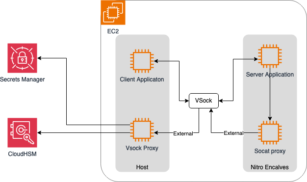

# Nitro Enclaves CloudHSM

This is a working (and usable) _proof of concept_ [AWS Nitro Enclaves + CloudHSM] applications. 

# Introduction

- sprint-boot-nitro-enclaves: A sprintboot library for nitro encalves application
- examples/cloudhsm: A demo to show cloudhsm application running in nitro enclaves

An enclave application partitions itself into two components:

1. An untrusted component (called the **host**) and
2. A trusted component (called the **enclave**).

This demo is to describe how to run java client application with CloudHSM sdk in Nitro Enclaves environment. You can refer this [blog](https://aws.amazon.com/cn/blogs/china/running-cloudhsm-applications-in-aws-nitro-enclaves/) for more details.

# Diagram

# Examples 

* [CloudHSM](examples/cloudhsm)
